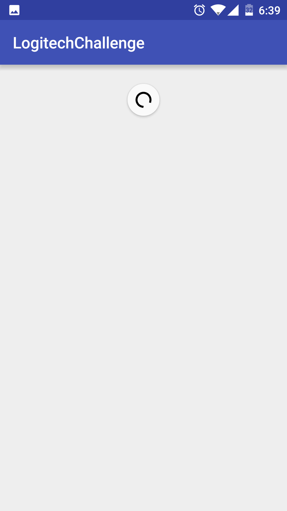
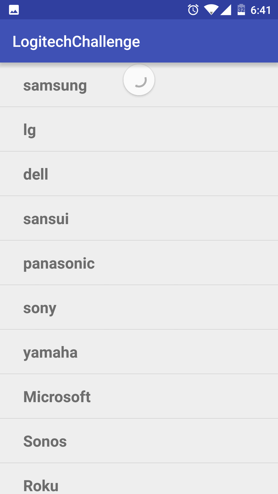
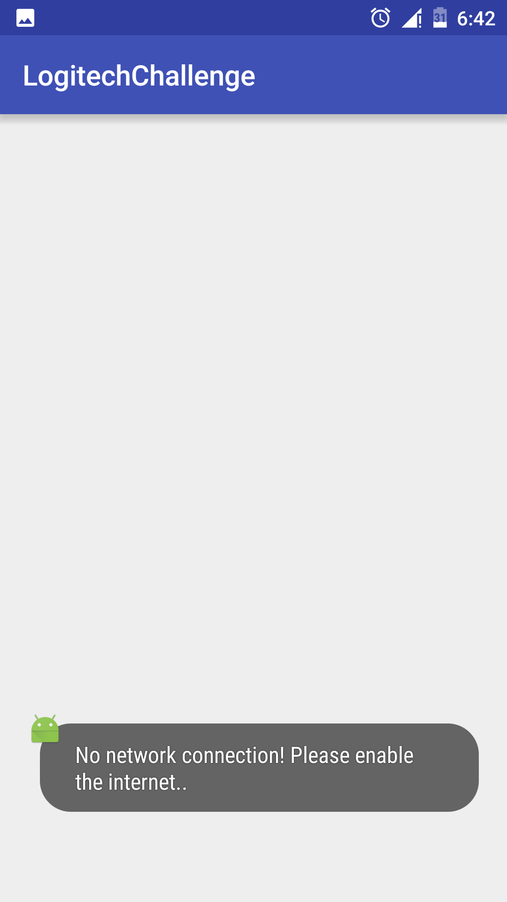

# LogitechChallenge

I have created a simple Android application to retrive the device list from the given `RESTful` services and display the device names into `listview`.

This application requires android min android version of 4.0.1. 

I have included the `Threading` by fetching the device details in separate thread and update the `listview` ui thread using `notifyDataSetChanged`. 

The application is designed with `swipe layout` to pull and refresh the data. Also checked the `network` availabilty and notifying the user if no data network enabled.

### Screenshots from the application

  
  

  
  

  

